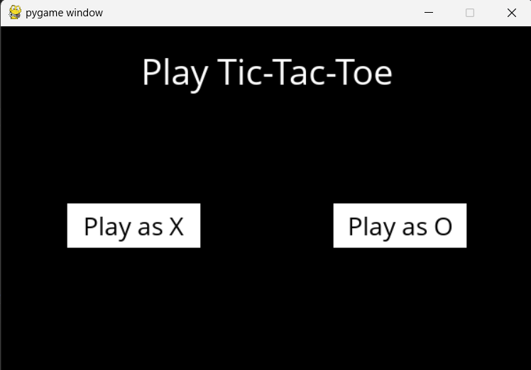
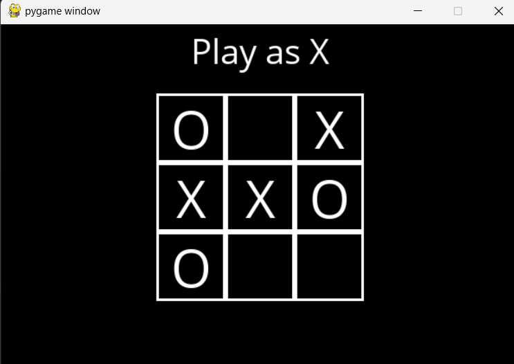

# Tic-Tac-Toe AI Player

A playable Tic-Tac-Toe game with an AI opponent using the minimax algorithm. Play against an unbeatable AI that makes optimal moves every turn.

## Project Description

This project implements a classic Tic-Tac-Toe game with an intelligent AI opponent. The game features:

- **Minimax Algorithm**: The AI uses the minimax algorithm with game theory to calculate the optimal move for every game state, making it unbeatable.
- **GUI Interface**: A user-friendly graphical interface built with Pygame allows you to choose your side (X or O) and play against the AI.
- **Game Logic**: Fully implemented game rules including win detection, terminal state checking, and move validation.

The project is perfect for understanding game theory, adversarial search algorithms, and how AI can play games optimally.

## What It Looks Like When Run

**Player Selection Screen:**


**Gameplay Screen:**


When you run the game:
1. First, you'll see the player selection screen where you can choose to play as X or O
2. The game board will display as a 3x3 grid
3. Click on an empty square to make your move
4. The AI will automatically calculate and make its optimal move
5. The game continues until there's a winner or the board is full
6. A message displays the final result (win, loss, or tie)

## How to Run

### Prerequisites
- Python 3.x installed on your system

### Installation

1. **Install dependencies:**
   ```bash
   pip install -r requirements.txt
   ```

2. **Run the game:**
   ```bash
   python runner.py
   ```

3. **Play the game:**
   - Click "Play as X" or "Play as O" to choose your side
   - Click on empty squares to make your moves
   - The AI will respond with its move
   - Close the window or use the quit button to exit

### Requirements
- pygame

The game uses Pygame for rendering the GUI and OpenSans font for text display.
